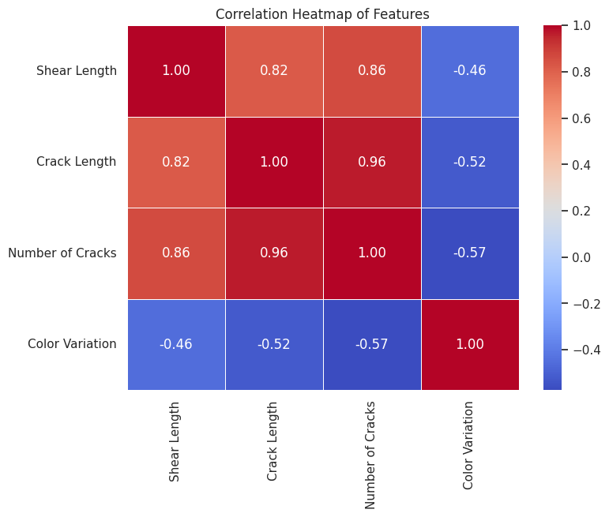
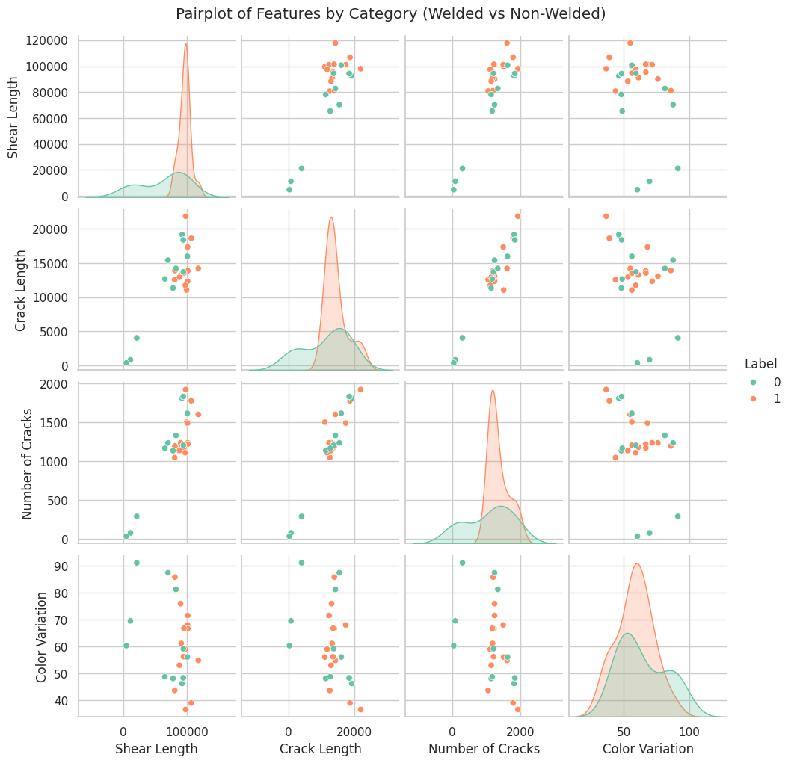
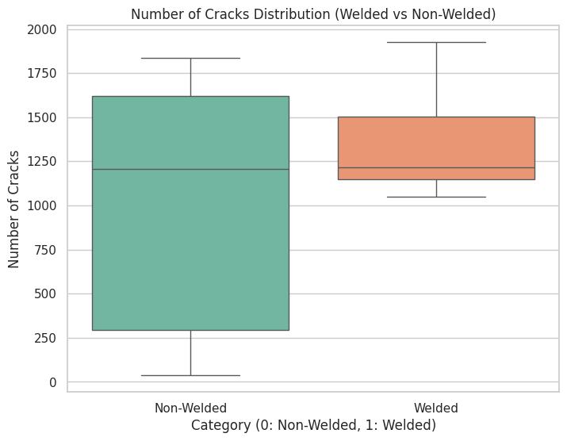
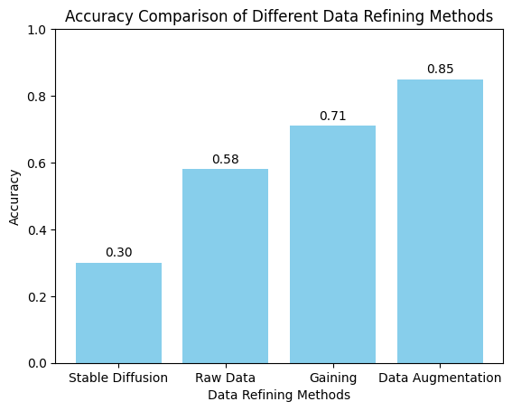

<h1>Lightweight Machine Learning for Real-Time Defect Detection in Industrial Welds</h1>

In industries such as automotive, aerospace, and construction, welding quality is critical to structural integrity. Defective welding can lead to cracks, shear marks, and color inconsistencies, reducing product durability and safety.

This project presents a multi-input machine learning model that fuses image features and numerical data to automatically classify welded vs. non-welded aluminum samples. The aim is to deliver a lightweight, real-time defect detection system that improves manufacturing quality control while reducing reliance on manual inspections.

---

## Features

- Multi-input ML model combining image data and numerical features
- CNN branch for weld image analysis (cracks, colors, textures)
- Dense branch for numerical data (shear length, crack count, etc.)
- Fusion layer for joint feature representation
- Binary classification: Welded (1) vs Non-Welded (0)
- Data augmentation to improve robustness
- Lightweight & real-time detection for industrial applications
- Achieved 85.71% accuracy on aluminum weld samples

---

## Results 

 

 

 

 


## Tech Stack

- Programming Language: Python 3.8+
- Machine Learning Frameworks:
  - TensorFlow / Keras or PyTorch (depending on implementation)
- Data Analysis & Visualization:
  - NumPy, Pandas, Matplotlib, Seaborn
- Model Development:
  - Convolutional Neural Networks (CNNs)
  - Fully Connected Dense Layers
  - Feature Fusion Layers
- Utilities:
  - Scikit-learn (metrics, preprocessing)
  - OpenCV / PIL (image handling)

---

## Setup Instructions

### Prerequisites

- Python 3.8+
- TensorFlow or PyTorch
- NumPy
- Pandas
- Matplotlib
- Scikit-learn
- OpenCV or Pillow (PIL)
- Jupyter Notebook / VS Code

---

### Clone the Repository

```bash
git clone https://github.com/lowbare3/real-time-weld-defect-detection.git
cd real-time-weld-defect-detection
```

### To run
- Open the generatecsv.py code and edit the path to the dataset.
- Run the generatecsv.py (it will generate a csv file named as output.csv).
- Open the train.py code and edit the path of the output.csv to wherever it is saved.
- Run train.py (it will train the model and give it to you).
- Run graphgenerator.py (it will give you all the details about the parameters).
- Run comparision.py to get comparision chart of different data refining methods used (optional).


## Future Improvements
- Expand the dataset with larger and more diverse weld samples to improve generalization.
- Extend the model to multi-class classification (detecting specific defect types).
- Explore 3D defect detection techniques using X-ray or CT scans for deeper analysis.
- Optimize the model further for edge deployment in real-time industrial environments.
- Investigate unsupervised / semi-supervised approaches to handle unseen defect types.
- Incorporate explainable AI (XAI) techniques to interpret model decisions for industrial engineers.

